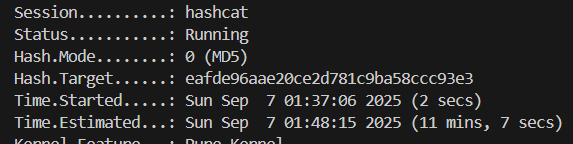
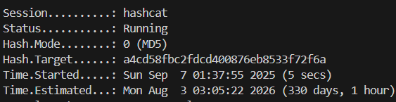
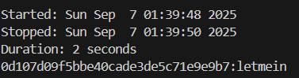
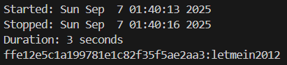
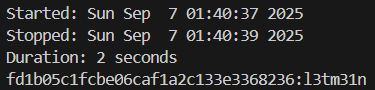
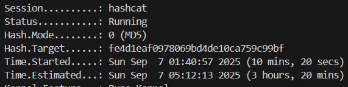

# Assignment 3 Question 2
Weak password bad yes.
## Weak Passwords
We will be using a set of predetermined passwords to demonstrate common password vulnerabilities and how they affect different common password cracking methods. The passwords will have the following characteristics: 
- password of length 5 using only random lowercase letters
- password of length 8 using only random lowercase letters
- password of length 8 using all upper/lowercase letters and digits
- common dictionary words
- common dictionary words with numbers appended at the back
- common dictionary words but leetspeak
- common dictionary words with proper casing, numbers appended at the back and leetspeak
- password of length 20 using a random assortment of characters

The passwords and their respective md5 hashes can be found in `passwords.txt`

## Cracking Methods
### Brute-force Attack
Brute-force attacks basically try every combination of characters in order to attempt to guess the password. In our case, since we are trying to demonstrate how password length determines the time to crack the password, we can use the exact length and specifications.

Each line in `BruteForce/commands.sh` corresponds to each of the first 3 aforementioned password types in the previous section. `?l` refers to a lowercase letter and `?a` refers to every typable ASCII character.

### Rule-based Dictionary Attack
A dictionary attack makes use of a list of common words or phrases that is expected to be used as a password (called a dictionary) and attempt to use them as the password to see if they are in fact the password used. Rules take this a step further by altering each word in the dictionary to create alternatives that may stem from each of them depending on what rules are given and employed. Some examples being additional numbers added at the back of the words or using leetspeak to replace characters in the word. 

For our purposes, we will be using the updated version of OneRuleToRuleThemAll, OneRuleToRuleThemStill as the rule and the classic rockyou.txt dictionary for our rule based dictionary attack.

If you intend to run it yourself, download rockyou.txt from github and paste into DictionaryAndRule folder. Simply run the bash file along with the hash to crack at the end of it.

Credits to https://github.com/stealthsploit/OneRuleToRuleThemStill for the custom hashcat rule.

## Password Cracking Times
### Brute-force Attack

From this, we can tell that the password of length 5 using only random lowercase letters took a really low time to crack using brute force.

A slightly longer password of length 8 using only random lowercase letters still took a short amount of time to crack, but many times longer than the password of length 5.

A password of length 8 using all upper/lowercase letters and digits takes an infeasible amount of time to crack, which would explain why most websites have requirements of having a password of at least minimum length 8 including a digit or a special character.

Overall, this tells us that increasing the number/type of characters used in the password as well as increasing its length strengthes the password against brute-force attacks.

### Rule-based Dictionary Attack

From these 3 results, we can tell that common dictionary words, with either variations of additional numbers appended or replaced with leetspeak does not strengthen the password much against good rule-based dictionary attacks.

Using variations where proper casing, numbers appended at the back and leetspeak is employed may increase the length of time required to complete the attack but does not prevent it from being cracked within a reasonable timeframe.

### Conclusion
In general, given that the number of attempts for an average rig is 10^10 a second for md5 hashes, the maximum time taken for each attack would be as follows:
- Brute-force: (p ^ n) / (10 ^ 10) where p is the number of possible characters and n is the length of the password
- Rule-based Dictionary Attack: n / (10 ^ 10) where n is the list of the entire altered dictionary

Knowing this, lets apply both attacks theoretically to the last password (password of length 20 using a random assortment of characters). The brute-force attack would take (95 ^ 20) / (10 ^ 10) seconds which would be 3.6 x 10^29s, which is more than several generations and is rather infeasible. The rule-based dictionary attack will take around 2-3 hours as it checks through every combination, but it will fail since the password is random and will not be found in the dictionary. This means that the last password is very secure and resistant against these attacks.

## Common Password Weaknesses to Avoid
From the information we know now, we can now identify common weaknesses in passwords we would want to avoid when creating our passwords.

### 1. Short length
Mosr websites have a requirement that all passwords must be at least 8–10 characters. From our observations previously, we now know that the given keyspace for upper/lowercase letters, digits and special characters is rather small for lengths below 7, making brute forcing the password a much more viable option. Every additional character exponentially increases the keyspace, preventing brute force attacks from being viable.

### 2. Combinations of Dictionary Keywords or Common Patterns
Words in the dictionary of any language, especially common words such as "Summer", "Password" and "Football" as well as common patterns such as keyboard sequences such as "qwerty" or simple repeated patterns such as "aaaaaaa" are easily susceptible to simple dictionary attacks and take up little to no time to search.

### 3. Addition of Numbers/Years at the End of the Password or Using Leetspeak (addition to previous point)
Adding number os years at the end or replacing letters with symbols like in leetspeak in passwords that would otherwise be found by dictionary attacks are still susceptible to a combination of rule based attacks as seen by previously, which may increase the time to crack it by a small amount, but not enough to prevent potential hackers from still easily cracking the password.

### 4. Using Personal Information in Passwords
Using of any personal information such as names, birthdays, phone numbers, pet names is also susceptible to attacks. While this was not showcased previously, such information can easily be found through social media or social engineering and added as words to a custom dictionary for a dictionary attack.

### 5. Reused Passwords
Reusing passwords does not decrease the strength of the password itself, but instead increases the chance of potential hackers accessing the account by finding passwords you reused on other sites through data leaks or otherwise and trying them on your accounts.

## Additional Good Password Creation Practices
### Good Practice Use of 2FA (2 Factor Authentication)
While not directly related to the strength of a password, using 2FA provides an additional layer that potential hackers will have to get through in order to access your account which is entirely independent of your password, making access to your account much more secure.

### Good Practice: Use of Password Managers
Password managers usually come with a feature to generate long length passwords using a random mix of upper/lowercase letters, digits and symbols, making the keyspace extremely large and practically impossible to brute-force while not having any patterns that can be exploited by dictionary + rule based attacks.